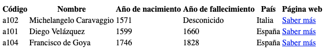

# Ejercicios

- [1. Ejercicio 1](#1-ejercicio-1)
  - [1.1. Objetivo](#11-objetivo)
  - [1.2. Solución](#12-solución)
  - [Solucion Complementaria](#solucion-complementaria)

## 1. Ejercicio 1

### 1.1. Objetivo

La tarea consiste en escribir una transformación XSLT que a partir de un fichero XML con datos de artistas genere una página web con una tabla con los datos de los artistas.

El elemento raíz del fichero es artistas. Dentro de este elemento hay uno o más elementos artista, como se puede ver en el ejemplo. Todos los elementos y atributos son obligatorios, salvo el elemento fallecimiento.

Un ejemplo de estos ficheros sería:

```xml
<?xml version="1.0" encoding="UTF-8"?>
<artistas>
  <artista cod="a101">
    <nombreCompleto>Diego Velázquez</nombreCompleto>
    <nacimiento>1599</nacimiento>
    <fallecimiento>1660</fallecimiento>
    <pais>España</pais>
    <fichaCompleta>https://es.wikipedia.org/wiki/Diego_Vel%C3%A1zquez</fichaCompleta>
  </artista>
  <artista cod="a102">
    <nombreCompleto>Michelangelo Caravaggio</nombreCompleto>
    <nacimiento>1571</nacimiento>
    <pais>Italia</pais>
    <fichaCompleta>https://es.wikipedia.org/wiki/Caravaggio</fichaCompleta>
  </artista>
  <artista cod="a103">
    <nombreCompleto>Herrada de Landsberg</nombreCompleto>
    <nacimiento>1125</nacimiento>
    <fallecimiento>1195</fallecimiento>
    <pais>Alsacia</pais>
    <fichaCompleta>  https://es.wikipedia.org/wiki/Herrada_de_Landsberg</fichaCompleta>
  </artista>
  <artista cod="a104">
    <nombreCompleto>Francisco de Goya</nombreCompleto>
    <nacimiento>1746</nacimiento>
    <fallecimiento>1828</fallecimiento>
    <pais>España</pais>
    <fichaCompleta>https://es.wikipedia.org/wiki/Francisco_de_Goya</fichaCompleta>
  </artista>
</artistas>
```

Al aplicar la transformación, el resultado debe ser una página web válida. Es decir, tiene que tener todos los elementos básicos de una página web: título, codificación de caracteres, elementos, `html`, `body` y `head`.

Dentro del cuerpo de la página habrá una tabla, obtenida a partir de los datos del fichero `artistas.xml`.

1. La tabla tendrá una fila por cada artista mostrado, y una primera fila como como cabecera, con los nombres: `Código`, `Nombre`, `Año de nacimiento`, `Año de fallecimiento`, `País` y `Página web`.

2. Como se puede ver en el fichero, el año de fallecimiento no está disponible para todos los artistas. En ese caso, en la columna correspondiente se mostrará el texto `Desconocido`.

3. En la última columna, el valor se obtiene del elemento `fichaCompleta`. Debe mostrarse un vínculo a la dirección adecuada, con el texto `Saber más`.

4. Sólo se mostrarán los artistas nacidos despúes de `1500`.

5. Los artistas se mostrarán ordenados por año de nacimiento creciente. Es decir, en la primera fila, el que tenga un año de nacimiento anterior.

La web podría tener una apariencia tan simple como esta:



### 1.2. Solución

Tu solucion debe estar en el fichero [doc/ej01/artistas.xslt](./ej01/artistas.xslt).

### Solucion Complementaria

Crea un fichero de restricciones con XML Schema basándote en el fichero [`doc/ej01/artistas.xml`](./ej01/artistas.xml). Tu solución complementaria debería situarse en el fichero [doc/ej01/artistas.xslt](./ej01/artistas.xslt)
